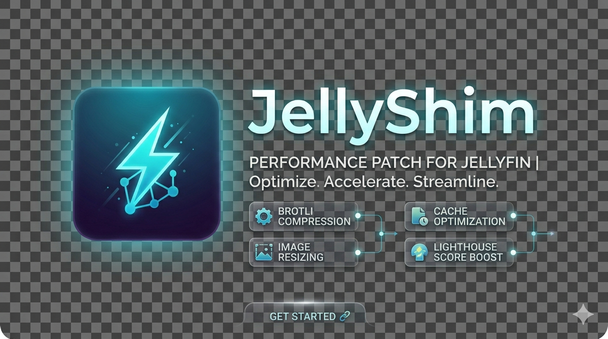

<p align="center">
  
</p>

<p align="center">
  
  
  
</p>

---

## 🎯 Why JellyShim?

Out of the box, Jellyfin serves uncompressed web assets, full-resolution images, and minimal cache headers. On slow networks, mobile clients, or instances with lots of media, this translates to **seconds of unnecessary loading**.

JellyShim fixes all of that in one plugin — no configuration needed:

- **60–90 % smaller assets** — JS/CSS/SVG minification + Brotli/Zstd/Gzip pre-compression
- **50–80 % smaller images** — native resizing + AVIF/WebP conversion (opt-in)
- **Instant repeat visits** — intelligent disk caching with ETag + 304 Not Modified support
- **Faster first paint** — HTTP `Link` modulepreload, font preload, and preconnect headers
- **Third-party plugin assets** — JS/CSS/SVG from JellyTweaks, JellyfinEnhanced, etc. get the same full pipeline
- **Live performance dashboard** — real-time cache hit/miss rates, bytes served/saved, per-category stats
- **12 languages** — Admin UI fully translated (EN, FR, DE, ES, IT, PT, NL, PL, RU, JA, KO, ZH)

**Install → Restart → Done.** Most optimizations are on by default. Nothing on disk is modified — disable the plugin and everything reverts instantly.

---

## 📦 Installation

### Add Repository (recommended)

1. In Jellyfin, go to **Dashboard → Plugins → Repositories**
2. Click **Add** and enter:
   - **Name:** `JellyShim`
   - **URL:** `https://raw.githubusercontent.com/alexisometric/jellyshim/main/manifest.json`
3. Go to **Catalog**, find **JellyShim**, click **Install**
4. Restart Jellyfin

### Manual Install

1. Download the latest release DLL from [Releases](../../releases)
2. Copy to your Jellyfin plugins directory:

   | Platform | Path |
   |---|---|
   | Linux | `~/.local/share/jellyfin/plugins/JellyShim/` |
   | Docker | `/config/plugins/JellyShim/` |
   | Windows | `%APPDATA%\jellyfin\plugins\JellyShim\` |

3. Restart Jellyfin

### Build from Source

```bash
git clone https://github.com/alexisometric/jellyshim.git
cd jellyshim
dotnet build -c Release
```

Output: `Jellyfin.Plugin.JellyShim/bin/Release/net9.0/Jellyfin.Plugin.JellyShim.dll`

---

## 💬 Contributing

JellyShim is **open source** and built for the community — everyone is welcome to contribute!

- **Found a bug?** [Open an issue](https://github.com/alexisometric/jellyshim/issues/new) — describe what happened and we'll look into it
- **Have an idea?** [Suggest a feature](https://github.com/alexisometric/jellyshim/issues/new) — all improvement proposals are welcome
- **Want to code?** Fork the repo, make your changes, and submit a pull request

Whether it's a typo fix, a new optimization, or a performance tweak — every contribution helps make Jellyfin faster for everyone.

---

## ✨ Feature Overview

| # | Feature | Default | What it does |
|---|---|:---:|---|
| 1 | [JS/CSS/SVG Minification](#1--jscsssvg-minification) | ✅ On | Strips whitespace, comments, shortens names, cleans SVG metadata |
| 2 | [Brotli/Zstd/Gzip Pre-compression](#2--brotlizstdgzip-pre-compression) | ✅ On | Pre-compresses all text assets to disk cache |
| 3 | [Native Image Optimization](#3--native-image-optimization) | ❌ Off | Resize + re-encode every Jellyfin image in-process (AVIF/WebP/JPEG) |
| 4 | [Smart Cache Headers](#4--smart-cache-headers) | ✅ On | Optimal Cache-Control per asset type |
| 5 | [Link Preload Headers](#5--link-preload-headers) | ✅ On | HTTP Link headers for fonts, JS, and preconnect |
| 6 | [CORS / CORP Headers](#6--cors--corp-headers) | ✅ On | Cross-Origin-Resource-Policy for iframe embedding |
| 7 | [Security Headers](#7--security-headers) | ❌ Off | HSTS, CSP, X-Frame-Options, X-Content-Type-Options, Referrer-Policy, Permissions-Policy |
| 8 | [Plugin Asset Support](#8--plugin-asset-support) | ✅ On | On-the-fly minification + compression for community plugin assets |
| 9 | [Cache Management](#9--cache-management) | — | Clear Cache button + scheduled task |
| 10 | [Performance Dashboard](#10--performance-dashboard) | ✅ On | Live cache/compression stats in the admin UI + REST API |
| 11 | [Localization](#11--localization) | ✅ On | Admin UI in 12 languages |

---

## 1 · JS/CSS/SVG Minification

Uses [NUglify](https://github.com/trullock/NUglify) to minify JavaScript and CSS, and a built-in regex-based SVG optimizer.

- **Pre-built assets** (under `/web/`) are minified during the startup scan
- **Plugin assets** (JellyTweaks, JellyfinEnhanced, etc.) are minified on-the-fly on first request
- **SVG optimization** — Removes XML comments, declarations, `<!DOCTYPE>`, `<metadata>`, editor-specific elements (Inkscape, Illustrator, Sketch), empty `id` attributes, and collapses whitespace
- **Extensionless URLs** (e.g. `/JellyfinEnhanced/script`) are detected via Content-Type sniffing
- Automatically skips already-minified files (heuristic: < 1 % newlines)
- Falls back to original on any parse error — never breaks assets

> **Config:** `EnableMinification` (default `true`) · `EnableSvgMinification` (default `true`)

---

## 2 · Brotli/Zstd/Gzip Pre-compression

All compressible assets (`.js`, `.css`, `.html`, `.json`, `.svg`, `.xml`, `.txt`, `.map`, `.mjs`) are pre-compressed at server startup and stored in a disk cache. Requests are served with zero runtime compression cost.

```
Original asset: 450 KB
├── Brotli (q11):  52 KB  (-88 %)
├── Zstd:          58 KB  (-87 %)
└── Gzip:          68 KB  (-85 %)
```

- **Accept-Encoding negotiation** — Serves Brotli when supported, Zstd as second choice, Gzip fallback, raw as last resort
- **Configurable quality** — Brotli level 0–11 (default 11 = maximum compression)
- **Scheduled re-processing** — Runs at startup + every day at 4 AM

> **Config:** `EnableCompression` · `EnableZstdCompression` (default `true`) · `BrotliCompressionLevel` (0–11, default `11`)

---

## 3 · Native Image Optimization

**Built-in image processing powered by [ImageSharp](https://sixlabors.com/products/imagesharp/) for resizing and Jellyfin's bundled ffmpeg (libaom-av1) for AVIF encoding — no external service, no Docker sidecar, nothing to install.**

JellyShim intercepts all Jellyfin image requests and processes them on the fly:

1. **Resize** — Downscale to a per-type max width (preserves aspect ratio, never upscales)
2. **Re-encode** — Convert to AVIF, WebP, or JPEG with per-type quality
3. **Cache** — Processed images saved to disk; subsequent requests served instantly
4. **304 support** — ETag-based conditional requests avoid re-sending unchanged images

### Format Negotiation

| Config value | Behavior |
|---|---|
| `avif` | Serve AVIF if browser supports it, JPEG fallback |
| `webp` | Serve WebP if browser supports it, JPEG fallback |
| `jpeg` | Always serve JPEG |
| `auto` | Prefer AVIF → WebP → JPEG based on `Accept` header |

### Per-Type Independent Settings

Every Jellyfin image type has its own **max width** and **quality**, giving you full granular control:

| Image Type | Description | Default Width | Default Quality |
|---|---|---:|---:|
| **Primary** | Poster, cover art, album art | 600 px | 80 |
| **Backdrop** | Background art, detail view | 1920 px | 75 |
| **Art** | Fan art, clear art | 1280 px | 75 |
| **Banner** | Wide banner images | 1000 px | 80 |
| **Logo** | Transparent logo overlays | 400 px | 90 |
| **Thumb** | Thumbnail previews | 480 px | 75 |
| **Screenshot** | TV episode screenshots | 1280 px | 75 |
| **Chapter** | Chapter thumbnails in player timeline | 400 px | 70 |
| **Profile** | User profile pictures | 200 px | 85 |
| **Disc** | CD/DVD/Blu-ray disc art | 300 px | 80 |
| **Box** | Box art (front) | 300 px | 80 |
| **BoxRear** | Box art (rear) | 300 px | 80 |
| **Default** | Fallback for any unrecognized type | 300 px | 80 |

> **Config:** `EnableImageOptimization` (default `false`) · `EnableImageCache` (default `true`) · `ImageOutputFormat` (default `auto`) · per-type `*MaxWidth` and `*Quality`

---

## 4 · Smart Cache Headers

Applies optimal `Cache-Control`, `ETag`, `Vary`, and `stale-while-revalidate` headers based on what's being served:

| Asset Category | Cache Strategy | Default TTL |
|---|---|---|
| Hashed assets (`main.a1b2c3d4.js`) | `public, immutable` | 1 year |
| Static web assets (`/web/*`) | `public` + stale-while-revalidate | 30 days |
| Plugin static assets | `public` + stale-while-revalidate | 1 day |
| HTML entry points (`index.html`) | `no-cache, must-revalidate` | — |
| Processed images | `public` + stale-while-revalidate | 30 days |
| Fonts (`.woff2`, `.woff`, `.ttf`, ...) | `public, immutable` | 1 year |
| API endpoints | **`no-store`** | — |

**Key behaviors:**
- **Automatic hashed asset detection** — Filenames with 8+ hex characters (e.g., `main.a1b2c3d4.js`) get `immutable` caching
- **ETag + 304** — In-memory ETag cache (ConcurrentDictionary) based on SHA-256 content hash; serves 304 Not Modified on match
- **API safety** — **30+ Jellyfin API prefixes** are never cached (`/System/`, `/Sessions/`, `/Library/`, `/Items/`, `/Users/`, `/Playlists/`, `/Search/`, `/Audio/`, `/Videos/`, etc.)

> **Config:** `EnableCacheHeaders` · `HashedAssetMaxAge` · `StaticAssetMaxAge` · `PluginAssetMaxAge` · `StaleWhileRevalidate` · `ImageCacheMaxAge` · `ImageStaleWhileRevalidate`

---

## 5 · Link Preload Headers

Adds HTTP `Link` headers that trigger the browser to start fetching critical resources **during** the HTTP response — before the HTML parser even sees the `<link>` tags:

- **Fonts** → `Link: </web/font.woff2>; rel=preload; as=font; type=font/woff2; crossorigin`
- **JavaScript** → `Link: </web/main.js>; rel=modulepreload`
- **Preconnect** → `Link: <https://example.com>; rel=preconnect` — Tells the browser to open TCP + TLS connections to external origins early (useful for third-party APIs, CDNs, etc.)

> **Config:** `EnableFontPreloadHeaders` · `EnableJsModulepreloadHeaders` · `EnablePreconnectHeaders` (default `false`) · `PreconnectOrigins` (one per line)

---

## 6 · CORS / CORP Headers

Adds `Cross-Origin-Resource-Policy` to all static assets and images:

- Default: `cross-origin` — enables iframe embedding for **Jellyseerr**, **Organizr**, **Homepage**, etc.
- Options: `cross-origin`, `same-site`, `same-origin`

> **Config:** `EnableCrossOriginResourcePolicy` · `CrossOriginResourcePolicyValue`

---

## 7 · Security Headers

Optional hardening headers for security-conscious deployments:

| Header | Default | Default Value |
|---|:---:|---|
| `X-Content-Type-Options` | ✅ | `nosniff` |
| `Referrer-Policy` | ✅ | `strict-origin-when-cross-origin` |
| `Permissions-Policy` | ✅ | `accelerometer=(), camera=(), geolocation=(), gyroscope=(), magnetometer=(), microphone=(), usb=()` |
| `Strict-Transport-Security` (HSTS) | ❌ | `max-age=31536000; includeSubDomains` |
| `Content-Security-Policy` (CSP) | ❌ | `default-src 'self'; script-src 'self' 'unsafe-inline'; style-src 'self' 'unsafe-inline'; img-src 'self' data: blob:; ...` |
| `X-Frame-Options` | ❌ | `SAMEORIGIN` |

**Note:** HSTS, CSP, and X-Frame-Options each have their own toggle and are disabled by default. The basic trio (X-Content-Type-Options, Referrer-Policy, Permissions-Policy) is controlled by the main `EnableSecurityHeaders` toggle.

> **Config:** `EnableSecurityHeaders` (default `false`) · `EnableHsts` (default `false`) · `HstsMaxAge` · `HstsIncludeSubDomains` · `EnableContentSecurityPolicy` (default `false`) · `ContentSecurityPolicy` · `EnableXFrameOptions` (default `false`) · `XFrameOptionsValue`

---

## 8 · Plugin Asset Support

Since v1.0.7, JellyShim captures, minifies, compresses, and caches **third-party plugin assets on the fly** — the same full pipeline that web assets get.

**How it works for JS/CSS:**
1. First request: intercepts the upstream response, minifies with NUglify, compresses Brotli + Zstd + Gzip, caches all variants (raw/br/zstd/gz) to disk
2. Subsequent requests: served directly from disk cache with ETag/304 support
3. Non-JS/CSS plugin assets (images, fonts, etc.) get optimized cache headers only

**Supports extensionless URLs** — Assets served without file extensions (e.g. `/JellyfinEnhanced/script`) are detected via upstream `Content-Type` header and minified accordingly.

**Pre-configured plugin paths:**
- HomeScreen, JellyTweaks, MediaBarEnhanced, Announcements, JellyfinEnhanced, JavaScriptInjector

Add your own paths in the admin UI (one per line, e.g. `/MyPlugin/`).

### File Transformation Compatibility

Plugins like **Home Screen Sections** (HSS), **Custom Tabs**, and **JellyfinEnhanced** use the [File Transformation](https://github.com/IAmParadox27/jellyfin-plugin-file-transformation) plugin to patch Jellyfin's webpack bundles at runtime.

JellyShim detects this automatically: **when any FT bypass patterns are configured, ALL `.chunk.js` and `.bundle.js` files are bypassed from the pre-built cache**. Instead, these files are captured from upstream (after FT has applied its patches), then compressed and cached separately with `no-cache` (forces ETag revalidation on every request).

This means you don't need to manually list every chunk filename — just having the default patterns is enough for full compatibility with any FT-based plugin.

> **Config:** `PluginAssetPaths` · `FileTransformationBypassPatterns`

---

## 9 · Cache Management

All optimized assets (pre-compressed web assets, on-the-fly plugin assets, processed images) are stored in a disk cache. Two ways to clear it:

- **Config page button** — Dashboard → Plugins → JellyShim → **Clear Cache**
- **Scheduled task** — Dashboard → Scheduled Tasks → **JellyShim: Clear Cache** (manual trigger, no automatic schedule)

Clearing the cache forces re-optimization on next access. Useful after plugin updates or to reclaim disk space.

### REST API

JellyShim exposes admin-only API endpoints for automation and monitoring:

| Method | Endpoint | Description |
|---|---|---|
| `GET` | `/JellyShim/CacheStats` | Cache file counts and sizes, per-prefix breakdown |
| `GET` | `/JellyShim/PerformanceStats` | Hit/miss rates, bytes served/saved, per-category counts |
| `POST` | `/JellyShim/PerformanceStats/Reset` | Reset all performance counters |
| `DELETE` | `/JellyShim/Cache/{prefix}` | Clear cache for a specific prefix (`plugin`, `ft`, `img`, `raw`, `br`, `gz`, `zstd`) |
| `GET` | `/JellyShim/ImageStatus` | AVIF support status, ffmpeg path, AV1 encoder info |
| `GET` | `/JellyShim/Localization/{lang}` | Translation strings for the admin UI |

All endpoints except Localization require administrator privileges (`RequiresElevation`).

---

## 10 · Performance Dashboard

The admin config page includes a live performance dashboard showing real-time statistics:

- **Cache hit/miss rate** — Percentage and total counts
- **Bytes served from cache** — Total data served directly from disk
- **Bytes saved by compression** — Bandwidth saved by serving compressed variants
- **Per-category request counts** — Web assets, plugin assets, File Transformation assets, images
- **304 Not Modified responses** — Requests avoided by ETag matching

All counters are thread-safe (atomic `Interlocked` operations) and persist for the Jellyfin process lifetime. `GetSnapshot()` reads all counters once to produce a consistent snapshot (avoids TOCTOU issues like hit rate > 100%). Reset via the dashboard or the REST API.

---

## 11 · Localization

The admin configuration page is fully translated into **12 languages**:

🇬🇧 English · 🇫🇷 French · 🇩🇪 German · 🇪🇸 Spanish · 🇮🇹 Italian · 🇵🇹 Portuguese · 🇳🇱 Dutch · 🇵🇱 Polish · 🇷🇺 Russian · 🇯🇵 Japanese · 🇰🇷 Korean · 🇨🇳 Chinese

The language is auto-detected from the browser. Translation files are embedded resources served via the `/JellyShim/Localization/{lang}` API.

---

## 🏗️ Architecture

JellyShim injects two ASP.NET Core middlewares early in the Jellyfin HTTP pipeline via a custom `IApplicationBuilderFactory`:

```
Client Request
       │
       ▼
┌──────────────────────────────────┐
│  ImageOptimizationMiddleware     │  Intercepts all Jellyfin image
│                                  │  endpoints (Items, Users, Artists,
│                                  │  Genres, Persons, Studios, etc.)
│                                  │  including /emby/ and /mediabrowser/
│  → Check disk cache             │
│  → If miss: capture response,   │
│    resize + re-encode, cache     │
│  → Upstream decompression        │
│    safety net (br/gz/zstd)       │
│  → Serve with ETag/304          │
└──────────┬───────────────────────┘
           │
           ▼
┌──────────────────────────────────┐
│  AssetOptimizationMiddleware     │  Intercepts /web/* and plugin paths
│                                  │
│  → Classify: web / plugin /     │
│    font / API / other            │
│  → Serve Brotli/Zstd/Gzip cache│
│  → Plugin JS/CSS: capture,      │
│    minify, compress, cache       │
│  → Inflight deduplication        │
│    (per-key SemaphoreSlim)       │
│  → Add Cache-Control, ETag,     │
│    Vary, CORP, security headers  │
│  → Skip API endpoints (30+)     │
└──────────┬───────────────────────┘
           │
           ▼
┌──────────────────────────────────┐
│  Jellyfin Default Pipeline       │  Static files, API, streaming...
└──────────────────────────────────┘
```

### Thread Safety

- **Config caching** — Parsed config strings (plugin paths, preconnect origins) use `volatile CachedStringArray?` sealed records for atomic snapshot reads — no torn state under concurrent access
- **FT pattern matching** — `FileTransformationMatcher` uses `volatile CachedRegexState?` for the same pattern; concurrent config changes cause benign duplicate regex recompilation, never crashes
- **Inflight locks** — `ConcurrentDictionary<string, SemaphoreSlim>` prevents duplicate processing of the same uncached asset; idle locks are cleaned up in `finally` blocks to prevent unbounded growth
- **Accept-Encoding** — `NegotiateEncoding` respects `q=0` per RFC 7231 §5.3.4 — encodings explicitly rejected by the client are skipped
- **Upstream decompression** — Both middleware pipelines strip `Accept-Encoding` before calling upstream, and decompress (Brotli/Gzip/Zstd) if upstream still compresses despite the stripped header
- **304 Not Modified** — All four 304 paths (web, FT, plugin, images) include `ETag`, `Vary`, and `Cache-Control` headers per RFC 7232 §4.1 for shared cache correctness

### Scheduled Tasks

| Task | Triggers | Purpose |
|---|---|---|
| **Optimize Web Assets** | Startup + daily 4 AM | Pre-processes all `/web/` assets: minify → transform HTML → compress Brotli + Zstd + Gzip → cache to disk |
| **Clear Cache** | Manual only | Clears all cached optimized assets; re-optimization happens on next access |

### Disk Cache Structure

```
{JellyfinCachePath}/jellyshim/
├── raw/     Minified but uncompressed assets
├── br/      Brotli-compressed assets
├── zstd/    Zstandard-compressed assets
├── gz/      Gzip-compressed assets
└── img/     Processed & cached images
```

---

## ⚙️ Configuration

After installation, go to **Dashboard → Plugins → JellyShim**.

**The default configuration is production-ready.** Most users only need to:

1. ✅ Install and restart — asset optimization, compression, and caching are already on
2. ☑️ Toggle **Enable Image Optimization** if you want image resizing + WebP conversion
3. 🎛️ (Optional) Tune per-type image width/quality to match your setup

### All Configuration Properties

<details>
<summary><strong>Asset Optimization</strong></summary>

| Property | Type | Default |
|---|---|---|
| `EnableMinification` | bool | `true` |
| `EnableSvgMinification` | bool | `true` |
| `EnableCompression` | bool | `true` |
| `EnableZstdCompression` | bool | `true` |
| `BrotliCompressionLevel` | int (0–11) | `11` |

</details>

<details>
<summary><strong>Cache Headers</strong></summary>

| Property | Type | Default |
|---|---|---|
| `EnableCacheHeaders` | bool | `true` |
| `HashedAssetMaxAge` | seconds | `31536000` (1 year) |
| `StaticAssetMaxAge` | seconds | `2592000` (30 days) |
| `PluginAssetMaxAge` | seconds | `86400` (1 day) |
| `StaleWhileRevalidate` | seconds | `86400` (1 day) |
| `ImageCacheMaxAge` | seconds | `2592000` (30 days) |
| `ImageStaleWhileRevalidate` | seconds | `604800` (7 days) |

</details>

<details>
<summary><strong>Link Headers</strong></summary>

| Property | Type | Default |
|---|---|---|
| `EnableFontPreloadHeaders` | bool | `true` |
| `EnableJsModulepreloadHeaders` | bool | `true` |
| `EnablePreconnectHeaders` | bool | `false` |
| `PreconnectOrigins` | textarea | _(empty)_ |

</details>

<details>
<summary><strong>CORS / Resource Policy</strong></summary>

| Property | Type | Default |
|---|---|---|
| `EnableCrossOriginResourcePolicy` | bool | `true` |
| `CrossOriginResourcePolicyValue` | string | `cross-origin` |

</details>

<details>
<summary><strong>Security Headers</strong></summary>

| Property | Type | Default |
|---|---|---|
| `EnableSecurityHeaders` | bool | `false` |
| `XContentTypeOptions` | string | `nosniff` |
| `ReferrerPolicy` | string | `strict-origin-when-cross-origin` |
| `PermissionsPolicy` | string | Restricts camera, mic, geolocation, etc. |
| `EnableHsts` | bool | `false` |
| `HstsMaxAge` | seconds | `31536000` (1 year) |
| `HstsIncludeSubDomains` | bool | `true` |
| `EnableContentSecurityPolicy` | bool | `false` |
| `ContentSecurityPolicy` | string | `default-src 'self'; script-src 'self' 'unsafe-inline'; ...` |
| `EnableXFrameOptions` | bool | `false` |
| `XFrameOptionsValue` | string | `SAMEORIGIN` |

</details>

<details>
<summary><strong>Image Optimization</strong></summary>

| Property | Type | Default |
|---|---|---|
| `EnableImageOptimization` | bool | `false` |
| `ImageOutputFormat` | string | `auto` |
| `EnableImageCache` | bool | `true` |

**Per-type settings** — Each with `*MaxWidth` (px) and `*Quality` (1–100):

Primary (600/80) · Backdrop (1920/75) · Art (1280/75) · Banner (1000/80) · Logo (400/90) · Thumb (480/75) · Screenshot (1280/75) · Chapter (400/70) · Profile (200/85) · Disc (300/80) · Box (300/80) · BoxRear (300/80) · Default (300/80)

</details>

<details>
<summary><strong>Plugin Asset Support</strong></summary>

| Property | Type | Default |
|---|---|---|
| `PluginAssetPaths` | textarea | HomeScreen, JellyTweaks, MediaBarEnhanced, Announcements, JellyfinEnhanced, JavaScriptInjector |
| `FileTransformationBypassPatterns` | textarea | `home*.chunk.js`, `main.*.bundle.js`, `runtime.bundle.js`, `user-plugin*.chunk.js` |

**Note:** When any FT patterns are configured, all `.chunk.js` and `.bundle.js` files are automatically bypassed — no need to list every chunk.

</details>

---

## 🔒 Security

- **No files modified on disk** — All optimizations live in the cache directory
- **Path traversal protection** — Cache rejects `..` segments AND validates the resolved path stays under the cache root
- **API endpoints never cached** — 30+ Jellyfin API prefixes explicitly excluded with `no-store`
- **Image size limit** — Rejects images larger than 50 MB before processing
- **Plugin asset size limit** — Responses larger than 2 MB are not captured
- **Upstream decompression safety net** — If upstream middleware compresses despite `Accept-Encoding` stripping, JellyShim decompresses before minification to avoid corruption
- **Optional security headers** — HSTS, CSP, X-Frame-Options, Referrer-Policy, Permissions-Policy, X-Content-Type-Options

---

## 🤝 Compatibility

| | Compatible |
|---|---|
| **Jellyfin** | 10.11.x and later |
| **Platforms** | Linux, Windows, macOS, Docker |
| **Reverse proxies** | Nginx, Caddy, Traefik, Apache, HAProxy |
| **Community plugins** | JellyTweaks, HomeScreen, MediaBarEnhanced, etc. |
| **Themes** | All Jellyfin themes (nothing on disk is modified) |
| **Clients** | Web, mobile, TV — all benefit from smaller transfers |
| **iframe dashboards** | Jellyseerr, Organizr, Homepage (via CORP header) |

### What JellyShim does NOT do

- ❌ Does **not** modify any original files on disk
- ❌ Does **not** cache or interfere with API responses or dynamic data
- ❌ Does **not** require any external service, Docker sidecar, or background process
- ❌ Does **not** affect streaming, transcoding, or playback in any way
- ❌ Disable the plugin → **everything reverts instantly**

---

## 📚 Dependencies

| Package | Version | Purpose |
|---|---|---|
| [NUglify](https://github.com/trullock/NUglify) | 1.21.17 | JS/CSS minification |
| [SixLabors.ImageSharp](https://sixlabors.com/products/imagesharp/) | 3.1.12 | Native image resizing & encoding |
| [ZstdSharp.Port](https://github.com/oleg-st/ZstdSharp) | 0.8.5 | Zstandard compression |
| ffmpeg (libaom-av1) | bundled | AVIF encoding (uses Jellyfin's bundled ffmpeg — zero install) |

---

## ❓ FAQ

<details>
<summary><strong>Will this break my Jellyfin setup?</strong></summary>

No. JellyShim only intercepts HTTP responses — it never modifies original files. Disable the plugin and everything returns to normal instantly.
</details>

<details>
<summary><strong>Does it work with Docker?</strong></summary>

Yes. JellyShim runs entirely inside the Jellyfin process. No sidecar containers or external services needed.
</details>

<details>
<summary><strong>How much bandwidth does image optimization save?</strong></summary>

Typically **50–80%** on image data. For example, a 500 KB JPEG poster becomes ~120 KB WebP at quality 80. Backdrops see even larger savings.
</details>

<details>
<summary><strong>Does it slow down my server?</strong></summary>

Asset pre-compression runs once at startup (and daily at 4 AM). Image processing happens on first request but results are cached to disk — subsequent requests are served instantly from cache.
</details>

<details>
<summary><strong>Can I use this with a CDN or reverse proxy cache?</strong></summary>

Yes. JellyShim adds proper `Vary`, `Cache-Control`, and `ETag` headers that CDNs and reverse proxies respect.
</details>

<details>
<summary><strong>Does it need imgproxy or any external tool?</strong></summary>

No. Image resizing uses ImageSharp (bundled DLL) and AVIF encoding uses Jellyfin's bundled ffmpeg. Everything runs inside the Jellyfin process — zero external dependencies.
</details>

<details>
<summary><strong>What about API endpoints — are they cached?</strong></summary>

Never. JellyShim maintains a comprehensive list of 30+ Jellyfin API path prefixes and explicitly marks them `no-store`. Dynamic data is never intercepted.
</details>

---

## 📄 License

MIT — see [LICENSE](LICENSE) for details.

---

<p align="center">
  <sub>Built to make every Jellyfin instance faster. ⚡</sub><br/>
  <sub><a href="https://github.com/alexisometric/jellyshim/issues">Report a bug</a> · <a href="https://github.com/alexisometric/jellyshim/issues">Request a feature</a> · <a href="https://github.com/alexisometric/jellyshim/pulls">Contribute</a></sub>
</p>

---

<details>
<summary><h2>🇫🇷 Version française</h2></summary>

### Pourquoi JellyShim ?

Par défaut, Jellyfin sert ses fichiers web sans compression, ses images en pleine résolution, et avec des en-têtes de cache minimaux. Sur un réseau lent, un client mobile, ou une instance avec beaucoup de médias, cela se traduit par **des secondes de chargement inutiles**.

JellyShim corrige tout ça en un seul plugin — aucune configuration requise :

- **60–90 % de fichiers en moins** — Minification JS/CSS + pré-compression Brotli/Zstd/Gzip
- **50–80 % d'images en moins** — Redimensionnement natif + conversion AVIF/WebP (optionnel)
- **Visites répétées instantanées** — Cache disque intelligent avec ETag + support 304 Not Modified
- **Premier affichage plus rapide** — En-têtes HTTP `Link` modulepreload, preload polices et preconnect
- **Assets de plugins tiers** — Le JS/CSS/SVG de JellyTweaks, JellyfinEnhanced, etc. bénéficie du même pipeline complet
- **Tableau de bord en temps réel** — Taux de cache hit/miss, octets servis/économisés, stats par catégorie
- **12 langues** — Interface d'administration entièrement traduite (EN, FR, DE, ES, IT, PT, NL, PL, RU, JA, KO, ZH)

**Installer → Redémarrer → C'est fait.** La plupart des optimisations sont activées par défaut. Aucun fichier n'est modifié sur le disque — désactivez le plugin et tout revient à la normale instantanément.

### Installation

#### Via le dépôt (recommandé)

1. Dans Jellyfin, allez dans **Tableau de bord → Plugins → Dépôts**
2. Cliquez **Ajouter** et entrez :
   - **Nom :** `JellyShim`
   - **URL :** `https://raw.githubusercontent.com/alexisometric/jellyshim/main/manifest.json`
3. Allez dans le **Catalogue**, trouvez **JellyShim**, cliquez **Installer**
4. Redémarrez Jellyfin

#### Installation manuelle

1. Téléchargez le dernier ZIP depuis les [Releases](../../releases)
2. Copiez-le dans le dossier plugins de Jellyfin :

   | Plateforme | Chemin |
   |---|---|
   | Linux | `~/.local/share/jellyfin/plugins/JellyShim/` |
   | Docker | `/config/plugins/JellyShim/` |
   | Windows | `%APPDATA%\jellyfin\plugins\JellyShim\` |

3. Redémarrez Jellyfin

### Fonctionnalités

| # | Fonctionnalité | Par défaut | Description |
|---|---|:---:|---|
| 1 | Minification JS/CSS/SVG | ✅ Activé | Supprime les espaces, commentaires, raccourcit les noms, nettoie les métadonnées SVG |
| 2 | Pré-compression Brotli/Zstd/Gzip | ✅ Activé | Pré-compresse tous les assets texte dans un cache disque |
| 3 | Optimisation d'images | ❌ Désactivé | Redimensionne + ré-encode chaque image Jellyfin (AVIF/WebP/JPEG) |
| 4 | En-têtes de cache intelligents | ✅ Activé | `Cache-Control` optimal selon le type d'asset |
| 5 | En-têtes Link preload | ✅ Activé | En-têtes HTTP `Link` pour les polices, le JavaScript et preconnect |
| 6 | En-têtes CORS / CORP | ✅ Activé | `Cross-Origin-Resource-Policy` pour l'intégration en iframe |
| 7 | En-têtes de sécurité | ❌ Désactivé | HSTS, CSP, X-Frame-Options, X-Content-Type-Options, Referrer-Policy, Permissions-Policy |
| 8 | Support des plugins tiers | ✅ Activé | Minification + compression à la volée pour les assets de plugins communautaires |
| 9 | Gestion du cache | — | Bouton de vidage du cache + tâche planifiée |
| 10 | Tableau de bord performances | ✅ Activé | Stats cache/compression en temps réel dans l'UI admin + API REST |
| 11 | Localisation | ✅ Activé | Interface d'administration en 12 langues |

### Sécurité

- **Aucun fichier modifié** — Toutes les optimisations vivent dans le répertoire de cache
- **Protection contre le path traversal** — Le cache rejette les segments `..` et valide que le chemin résolu reste sous la racine du cache
- **Les endpoints API ne sont jamais mis en cache** — 30+ préfixes de l'API Jellyfin explicitement exclus avec `no-store`
- **Limite de taille des images** — Les images de plus de 50 Mo sont rejetées
- **Limite de taille des assets plugin** — Les réponses de plus de 2 Mo ne sont pas capturées
- **Filet de sécurité pour la décompression** — Si le middleware upstream compresse malgré la suppression de `Accept-Encoding`, JellyShim décompresse avant la minification pour éviter toute corruption

### Compatibilité

| | Compatible |
|---|---|
| **Jellyfin** | 10.11.x et supérieur |
| **Plateformes** | Linux, Windows, macOS, Docker |
| **Reverse proxies** | Nginx, Caddy, Traefik, Apache, HAProxy |
| **Plugins communautaires** | JellyTweaks, HomeScreen, MediaBarEnhanced, JellyfinEnhanced, etc. |
| **Thèmes** | Tous les thèmes Jellyfin (rien n'est modifié sur le disque) |
| **Clients** | Web, mobile, TV — tous bénéficient de transferts plus légers |
| **Tableaux de bord iframe** | Jellyseerr, Organizr, Homepage (via l'en-tête CORP) |

### Ce que JellyShim ne fait PAS

- ❌ Ne modifie **aucun** fichier original sur le disque
- ❌ Ne met **pas** en cache et n'interfère **pas** avec les réponses API ou les données dynamiques
- ❌ Ne nécessite **aucun** service externe, conteneur Docker supplémentaire ou processus en arrière-plan
- ❌ N'affecte **en rien** le streaming, le transcodage ou la lecture
- ❌ Désactivez le plugin → **tout revient à la normale instantanément**

### FAQ

**Ça va casser ma config Jellyfin ?**
Non. JellyShim intercepte uniquement les réponses HTTP — il ne modifie jamais les fichiers originaux. Désactivez le plugin et tout redevient normal.

**Ça fonctionne avec Docker ?**
Oui. JellyShim s'exécute entièrement dans le processus Jellyfin. Aucun conteneur supplémentaire ni service externe nécessaire.

**Combien de bande passante l'optimisation d'images économise-t-elle ?**
Typiquement **50–80 %** sur les données d'images. Par exemple, un poster JPEG de 500 Ko devient ~120 Ko en WebP qualité 80.

**Est-ce que ça ralentit mon serveur ?**
La pré-compression des assets s'exécute une fois au démarrage (et quotidiennement à 4h du matin). Le traitement d'images n'a lieu qu'à la première requête, puis les résultats sont servis depuis le cache disque.

**Est-ce compatible avec un CDN ou un reverse proxy cache ?**
Oui. JellyShim ajoute les en-têtes `Vary`, `Cache-Control` et `ETag` appropriés que les CDN et reverse proxies respectent.

</details>
